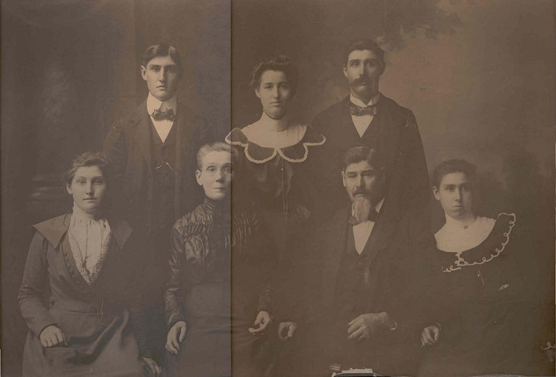

## 112. Johann Konrad Hopfer

Johann Konrad Hopfer was born 26 February 1837 in Kuppingen, Herrenberg, Wuerttemberg, Germany.  Like the other members of his family, after arriving in America, he became John Contrad HEPFER. John married Christina A. Stabler.  

Back Row Standing | [Henry Louis HEPFER](1125)
.                 | [Anna Mary (HEPFER) NELLER](1122)
.				  | [Charles Conrad HEPFER](1121)
Seated | [Emma Christine (HEPFER) STOLL](1124)
.       | Christina A. (STABLER) HEPFER
.		| John Conrad HEPFER
.		| [Lydia Clara (HEPFER) FILL](1123)

John took up farming in Washtenaw County, Michigan.  Later, he moved to DeWitt Township, Clinton, Michigan buying: 40 acres, Section 16, plus 80 acres Section 21 in DeWitt Township. John later resided on the George Jacob HEPFER homestead.  

John died 28 January 1920 and was buried at the Hurd Cemetery in DeWitt Township, Clinton, Michigan.

Christina A. STABLER was born 28 March 1846 in Michigan and died 23 June 1916.  Christina was buried at the Hurd Cemetery in DeWitt Township, Clinton, Michigan.

To this union five children were born.

| [1121.](1121) | [Charles Conrad HEPFER](1121)
| --- | ---
b. | 11 November 1867
pb. | DeWitt Township, Clinton, Michigan
m. | 1 March 1894 Susan MANZ
m. | 11 February 1942 Louise Elizabeth NOSTRANT
d. | 12 December 1953, Lansing, Ingham, Michigan
bur. | Deepdale Cemetery, Lansing, Eaton, Michigan

| [1122.](1122) | [Anna Mary HEPFER](1122)
| --- | ---
b. | 21 November 1869
pb. | DeWitt Township, Clinton, Michigan
m. | 22 March 1894 Louis NELLER
d. | 25 September 1902
bur. | Hurd Cemetery, DeWitt Township, Clinton, Michigan

| [1123.](1123) | [Lydia Clara HEPFER](1123)
| --- | ---
b. | 14 April 1872
pb. | DeWitt Township, Clinton, Michigan
m. | 20 October 1890 Edward John FILL
d. | 4 July 1955, Lansing, Ingham, Michigan
bur. | Hurd Cemetery, DeWitt Township, Clinton, Michigan

| [1124.](1124) | [Emma Christine HEPFER](1124)
| --- | ---
b. | 26 October 1876
pb. | Lansing, Ingham, Michigan
m. | 16 March 1899 Edward STOLL
d. | 27 July 1937
bur. | Deepdale Cemetery, Lansing, Eaton, Michigan

| [1125.](1125) | [Henry Louis HEPFER](1125)
| --- | ---
b. | 7 November 1878
pb. | DeWitt Township, Clinton, Michigan
m. | 10 March 1904 Bertha Augusta MANZ
d. | 18 November 1973 Lansing, Ingham, Michigan
bur. | Hurd Cemetery, DeWitt Township, Clinton, Michigan 